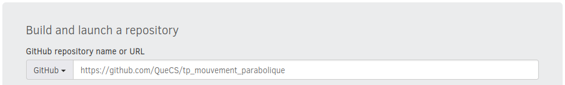
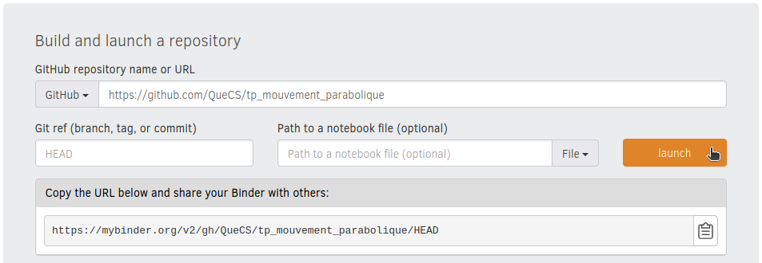
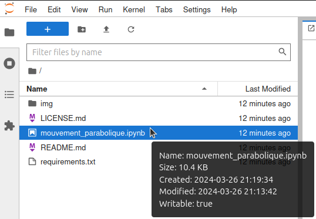

# Travaux Pratiques, Mouvement Parabolique, Partie 4

Ce dépôt est ma demonstration faite à un ami professeur de physique chimie dans le secondaire que les [Notebooks Jupyter](https://jupyter.org/) couplés à [Binder](https://jupyter.org/binder) constituent un outil relativement simple à mettre en place et puissant pour guider les élèves dans l'utilisation de code [Python](https://www.python.org/) au sein d'un TP de Physique à des fins d'analyse de données brutes.

# Practical Work, Parabolic Motion, Part 4

This repository is my demonstration to a friend, a high school physics and chemistry teacher, that [Jupyter Notebooks](https://jupyter.org/) coupled with [Binder](https://jupyter.org/binder) constitute a relatively simple and powerful tool to guide students in using [Python](https://www.python.org/) code to analyze raw data during practical classes.

## Comment utiliser ce dépôt ?

Rendez-vous sur [Binder](https://mybinder.org/) et copiez l'URL de ce dépôt dans le champ "GitHub repository name or URL".
```
https://github.com/QueCS/tp_mouvement_parabolique
```


Cliquez ensuite simplement sur "launch" et laissez Binder créer votre environnement de travail virtuel. Ça prendra quelques minutes et une fois ce dernier prêt, la page se rafraichira automatiquement pour le lancer sur un serveur distant.



Une fois votre environnement de travail affiché, il vous suffit d'ouvrir le fichier suivant et de vous laisser guider.



## Using this repository

Visit [Binder](https://mybinder.org/) and copy this repository URL into the field "GitHub repository name or URL".
```
https://github.com/QueCS/tp_mouvement_parabolique
```


Then simply click on "launch" and let Binder time to create your virtual working environment. This will take a few minutes and once it is ready, the page will automatically refresh itself to launch it on a remote server.


Once the working environment loaded simply open the following file and follow along.\
It will be in french though.

